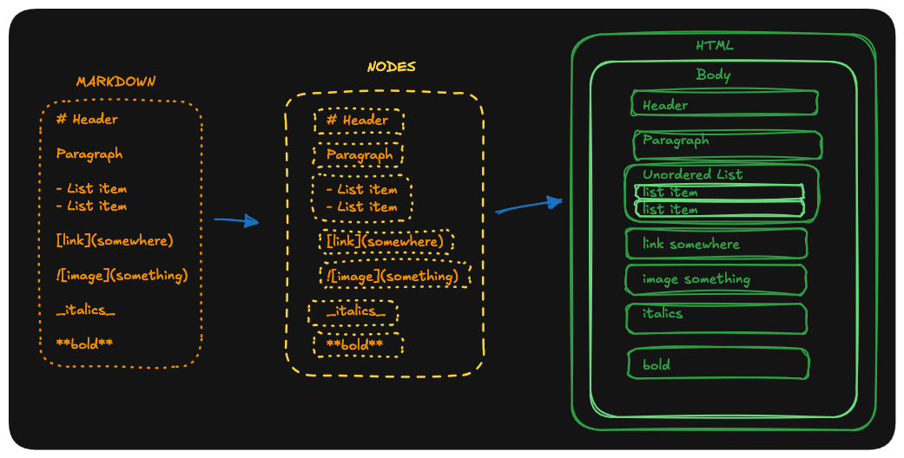

# webify

A static website generator. ✨Revolutionary✨ technology so you don't have to write HTML and CSS ever again!!

This is **Webify**, a little tool that takes Markdown files and converts them into a ready-to-serve website. It also copies CSS, images, and other kinds of stuff in the process.

The parser supports complex site structures, making sure the links work between pages and it supports a variety of different Markdown functionality, including links and images. 

Here's a site generated using the parser: [revolutionary site generated](https://dontsitdowncauseimovedyourchair.github.io/webify/)

## Requirements

- **Python**
- And that's it :D

## Quick start

From the project root:

```bash
./main.sh
```

This runs the generator and then serves the result. Open <http://localhost:8888> in your browser to see the magic.

`main.sh` is just two commands:

```bash
python3 src/main.py                        # build the site into docs/
cd docs && python3 -m http.server 8888   # serve it
```

You can run the build on its own with `python3 src/main.py`.

## Structure

```
webify/
├── content/           # Markdown source
│   └── index.md
├── static/            # static assets that are getting copied (CSS, images, the sky is the limit...)
│   ├── index.css
│   └── images/
├── template.html      # HTML shell with {{ Title }} and {{ Content }} placeholders
├── docs/              # GENERATED output (created by the build; safe to delete)
├── main.sh            # build + serve
├── test.sh            # for running the unit tests
└── src/               # the generator itself
```

### The template

`template.html` is a normal HTML page with two placeholders that the generator fills in:

- `{{ Title }}` is replaced with the text of the page's first `# H1` heading.
- `{{ Content }}`is replaced with the HTML generated from the Markdown.

## How it works

Running `python3 src/main.py` does three things (see `src/main.py`):

1. It copies the assets you have in the `static` folder into the `docs`folder.
2. It looks through the `content` folder and finds every Markdown file to convert into HTML, preserving the file structure of `content`.
3. The page is served in `docs/` over HTTP (via the main.sh script).

### The Markdown to HTML journey

### Nodes

- `TextNode`: A class that holds the intermediate representation between Markdown and HTML. 
- `HTMLNode`: base class holding a `tag`, `value`, `children`, and `props`, with `props_to_html()` for attributes.
- `LeafNode`: a node with no children (e.g. `<b>text</b>`, plain text, ``).
- `ParentNode`: a node with children (e.g. `<p>`, `<ul>`, `<div>`), rendered recursively.

The parser takes a markdown file and converts each Markdown block into a respective text node block which itself parses inline Markdown elements like bold, italics, images, and others. These nodes are then translated into HTMLNodes for their final conversion to pure HTML. 



## You can ✨customize your site✨

- Edit `content/index.md` to change the page content.
- Edit `template.html` to change the page shell (keep the `{{ Title }}` and `{{ Content }}` placeholders).
- Drop CSS, images, and other assets into `static/`, they're copied into `docs/` on every build.

## Unit tests
Unit tests were written extensively, TDD is key!.

## AI usage
The generator is hand-crafted, no AI involved in the making of the project aside from tests, some tests are AI-generated because there's more beautiful things to do in life than having to sit down and write unit tests. (And boy did this project require a lot of tests)